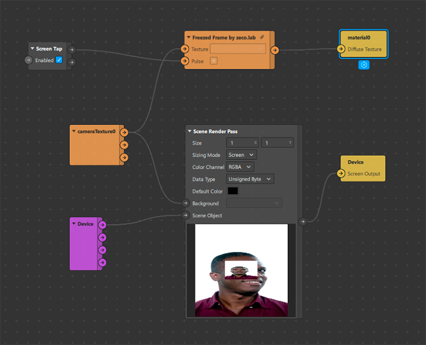

# Freezed-Frame-Spark-Ar-Patch
A patch to get a freezed frame from a texture when a pulse is triggered.

**This patch uses delay frame, so you must activate the Render Pass Default Pipeline**

Version: **Spark AR Studio v112**

## How to use

## Author
José Luís Haas

Follow me on Instagram [@zeco.lab](https://instagram.com/zeco.lab)

## License

